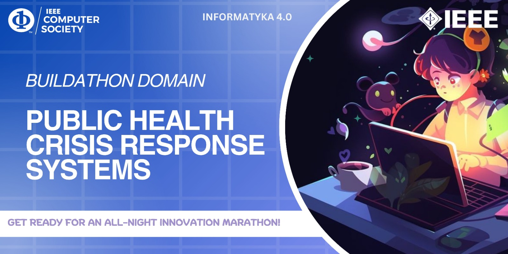

# {Project Name} - BUILDATHON
This is a project focusing on the area of mental health crisis. One of the major problem being faced by today's generation is the fact that people are underating the crisis of mental health among all the people irrespective of the age, sex or community they belong to. In this project,it focus on providing free and ads free interface where people can chat with a real time chatbot which according to the level of mental health crisis the user is going through would alert, analysis and reflect, provide suggestions based on the questions they are being answered to the chatbot. The site also provide festures like doctors appoiment booking, finding nearest ambulance contact info as well as real time position with respective to the user. 

## Team Members
[1.Krishnakumar PA](enter_github_id_here)   
[2.HariKrishna TS](enter_github_id_here)   
[3.Sreeram R](Raydo123)   
[4.Aleena Sidhikh](enter_github_id_here)   

## Link to Project
[Embed the live link of project](live_link)

## How it Works ?

## Technologies used
Majorly the tech stack being used in this project are as follows
1.HTML
2.CSS
3.JAVASCRIPT
The text editor being used throughout this project is Visual Studio Code. 

## Other Links
Provide any other links ( for eg. Wireframe , UI, Abstract, Presentation )
